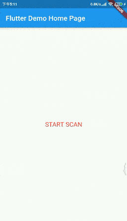

# flutter_uni_scanner

支持android端、ios端，采用zxing库。

## 示例

## 功能
- [x] 相机扫描二维码
- [x] 相机扫描条形码
- [x] 从相册选择图片识别二维码
- [x] 从相册选择图片识别条形码
- [x] 开关手电筒

## 采用的第三方库

android:
https://github.com/bingoogolapple/BGAQRCode-Android

ios:
https://github.com/MxABC/LBXScan

## 集成方法:

### 1 在pubspec.yaml中引入本插件:

    flutter_uni_scanner:
        git: https://github.com/moepanda/flutter_uni_scanner

### 2.1 android:
在android/app/src/main/AndroidManifest.xml文件中添加以下内容

    <manifest >
        <uses-permission android:name="android.permission.VIBRATE" />
        <uses-permission android:name="android.permission.CAMERA" />
        <uses-permission android:name="android.permission.READ_EXTERNAL_STORAGE" />

        <application>
           ...
            <activity android:name="com.moepanda00.flutter_uni_scanner.QScanActivity"/>
            ...
        </application>
    </manifest>

### 2.2 ios:
在Info.plist文件中添加以下权限:

    <key>NSCameraUsageDescription</key>
    <string>...</string>
    <key>NSPhotoLibraryUsageDescription</key>
    <string>...</string>

### 3 调用方法:

    Map map = await FlutterUniScanner.startScan;
    print("Code is:"+map['code']);